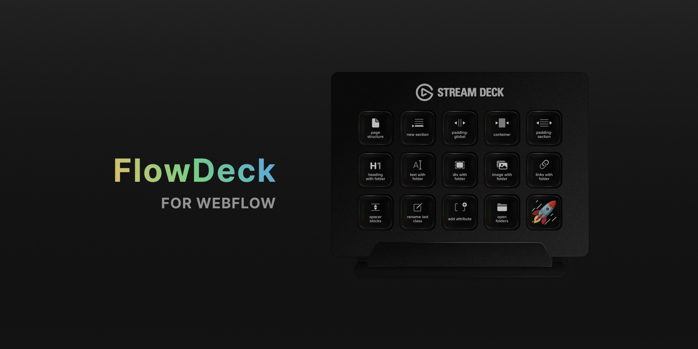
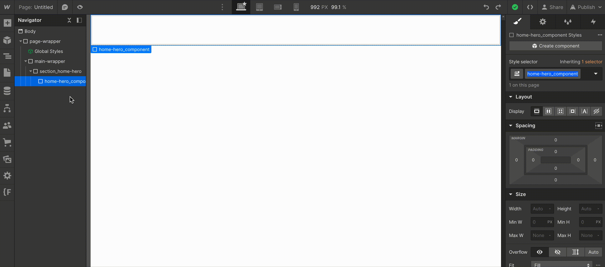

# FlowDeck

> **Note: This project is currently under active development.**

### Table of Contents

- [Project Details](#project-details)
- [Quickstart](#quickstart)
- [Profile Overview](#profile-overview)
- [Browser Migration](#browser-migration)

---

## Project Details

### Objective

FlowDeck is a method for using a Stream Deck profile to enhance the Webflow build experience. The primary objective is to create a comprehensive profile to automate some of the more complex tasks required when building with Webflow frameworks like Client-First. This will allow you to streamline your workflow and stay organized throughout your build, while providing intuitive control over various build actions and object creation.

### Project Status

FlowDeck is still a work in progress. We are actively developing and refining the Stream Deck profiles to ensure they meet the needs of Webflow developers.

### Features (planned)

- Intuitive control of Webflow build actions
- Real-time visual feedback for seamless workflows
- Enhanced productivity and speed for Webflow development
- Profiles for Stream Deck, Stream Deck XL, and Stream Deck Mini (iOS Free Tier)
- Profiles tailored to Client-First Framework (other frameworks to follow)

### Disclaimer

Please note that while we strive to provide a stable and reliable solution, FlowDeck is currently a work in progress. Use it at your own risk, and we appreciate your understanding and patience during the development process.

We are in no way affiliated with Webflow or {Finsweet.

---

## Quickstart

### Requirements

Some of the more advanced automations regarding specific frameworks require some Applescript to work, these profiles will be marked as MacOS only. Don't forget the Webflow step below, it's very important to how the automations work.

- Tested on MacOS 10.11 or later
- Stream Deck App/Software
- Stream Deck Plugin for Applescript: [OSA Script](https://apps.elgato.com/plugins/com.gabrielperales.osascript)
- Google Chrome (can be used with other Chromium based browsers with [minor changes to select actions, see Browser Migration](#browser-migration))
- Allow JavaScript from Apple Events in the developer tab of your browser
- **In Webflow** bring up the **Quick Find** bar with cmd or ctrl + k or e, and click on the settings icon on the right end of the bar, make sure all actions are enabled **except** for 'Add asset'
- *Some client first related actions will require the [Finsweet Extension](https://chrome.google.com/webstore/detail/finsweet-extension-for-we/mjfibgdpclkaemogkfadpbdfoinnejep)*

### Installation

After choosing the [profiles](#profile-overview) you'd like to use on your Stream Deck and downloading them, follow these instructions to import them:

1. Open the **Stream Deck** software and open the **Settings**
2. In the **Settings** click on the **Profiles** tab
3. Click on the down arrow at the bottom right of the **Profiles** window and click **Import...**
4. Navigate to your downloaded profile(s) and click to add them.
5. The imported profile(s) will be added to your profile list for that device.

### Post-Install

The profiles are setup with a variety of tools ready to be used, but to take full advantage of the idea behind this concept, explore the actions and modify them or the layout to best suit your workflow!

---

## Profile Overview

The profiles below are currently planned or available depending on their status. Plans specific to certain frameworks, like Client-First for example, won't **only** contain framework specific actions, rather they will aim to build on useful Webflow actions, with framework specific benefits.

For example, in the Client-First profiles below, any action that is listed as action **with folder** will add the element listed, and then will attempt to grab a class from the element currently selected on the canvas, extract the current folder from the class name, and paste it as a class on your new element, waiting for your input.

| Profile               	| File    	| Status 	|
|-----------------------	|---------	|:------:	|
| Client-First (6 Key)  	| [CF06.V1](profiles/client-first/FlowDeck%20CF06.V1.streamDeckProfile) 	|    🟢   	|
| Client-First (15 Key) 	| [CF15.V1](profiles/client-first/FlowDeck%20CF15.V1.streamDeckProfile) 	|    🟢   	|
| Client-First (32 Key) 	|           |    🔴   	|
| Webflow (Basic)       	|         	|    🔴   	|
| Webflow (Advanced)    	|         	|    🔴   	|
| Wized Actions         	|         	|    🔴   	|
| Mast Framework        	|         	|    🔴   	|

### Client-First

The Client-First profiles contain the following actions:

**6 Key**
- page structure
- new section
- padding-global
- div with folder
- rename last class
- text with folder

**15 Key**
- page structure
- new section
- padding-global
- container
  - container-small
  - container-medium
  - container-large
- padding-section
  - padding-section-small
  - padding-section-medium
  - padding-section-large
- heading with folder
  - h1 w/ folder
  - h2 w/ folder
  - h3 w/ folder
  - h4 w/ folder
  - h5 w/ folder
  - h6 w/ folder
- text with folder
- div with folder
- image with folder
- links with folder
  - text-link w/ folder
  - link-block w/ folder
- spacer blocks
  - spacer-block-small
  - spacer-block-medium
  - spacer-block-large
  - spacer-block-xlarge
- rename last class
- add attribute
- open folders
- publish

---

## Browser Migration

For some actions involving Applescript, a browser is specified. To use other browsers instead, you'll have to modify the Applescript in those actions to point at your new browser. 

To make the changes, click into the stream deck action (if it is a multi action, double click and look through the list for any "Custom: Run OSA script" actions where the first line says 'tell application "Google Chrome"'). Change the browser listed to the browser of your choice (Arc, Brave, etc.).

`tell application "Arc" activate`

The following actions have/are an Applescript (Run OSA script) action which requires updating:

- Add Attribute
- Add Heading H(1-6)
- H(1-6) w/ Folder
